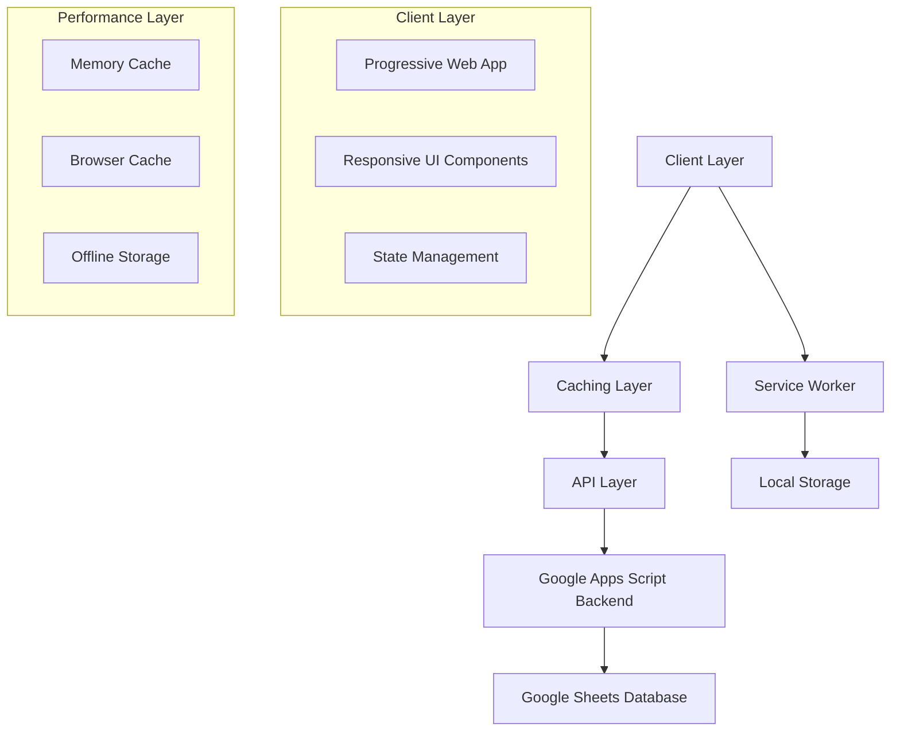

# POS System Optimization Design

## Overview

This design document outlines the technical approach for optimizing the Cost-POS system to create a fast, user-friendly, and efficient web application. The design focuses on performance optimization, responsive design, improved user experience, and cross-device compatibility while maintaining the existing Google Apps Script backend.

## Architecture

### High-Level Architecture



### Performance Optimization Strategy

1. **Frontend Optimization**
   - Implement virtual scrolling for large lists
   - Use lazy loading for non-critical components
   - Minimize JavaScript bundle size
   - Optimize CSS with critical path rendering

2. **Caching Strategy**
   - Implement multi-level caching (memory, browser, offline)
   - Cache frequently accessed data (ingredients, menus)
   - Use intelligent cache invalidation

3. **Network Optimization**
   - Batch API requests where possible
   - Implement request debouncing
   - Use compression for data transfer
   - Implement offline-first approach

## Components and Interfaces

### 1. Enhanced UI Components

#### Mobile-First Navigation System
```javascript
// Bottom Tab Navigation with gesture support
const TabNavigation = {
  tabs: ['home', 'purchase', 'sale', 'menu', 'reports'],
  activeTab: 'home',
  swipeGestures: true,
  hapticFeedback: true
}
```

#### Smart Form Components
```javascript
// Auto-completing input with recent suggestions
const SmartInput = {
  type: 'ingredient-selector',
  suggestions: [], // Recent/frequent items
  validation: 'real-time',
  keyboard: 'adaptive' // Changes based on input type
}
```

#### Responsive Data Tables
```javascript
// Adaptive table that becomes cards on mobile
const ResponsiveTable = {
  desktop: 'table-view',
  tablet: 'grid-view',
  mobile: 'card-view',
  virtualScrolling: true
}
```

### 2. Performance Components

#### Intelligent Caching System
```javascript
const CacheManager = {
  levels: {
    memory: 'instant-access',
    browser: 'session-persistent',
    offline: 'long-term-storage'
  },
  strategies: {
    ingredients: 'cache-first',
    menus: 'cache-first',
    sales: 'network-first',
    reports: 'stale-while-revalidate'
  }
}
```

#### Optimized Data Loading
```javascript
const DataLoader = {
  lazy: true,
  pagination: 50, // Load 50 items at a time
  prefetch: 'next-page',
  compression: 'gzip'
}
```

### 3. User Experience Components

#### Quick Action System
```javascript
const QuickActions = {
  frequentTasks: [
    'add-sale',
    'add-purchase',
    'check-stock',
    'daily-report'
  ],
  shortcuts: {
    'ctrl+s': 'quick-sale',
    'ctrl+p': 'quick-purchase'
  }
}
```

#### Smart Suggestions Engine
```javascript
const SuggestionEngine = {
  ingredients: 'usage-frequency',
  prices: 'recent-history',
  quantities: 'pattern-recognition',
  platforms: 'time-based' // Suggest based on time of day
}
```

## Data Models

### Enhanced Client-Side Models

#### Optimized Ingredient Model
```javascript
const IngredientModel = {
  id: 'string',
  name: 'string',
  stockUnit: 'string',
  buyUnit: 'string',
  ratio: 'number',
  minStock: 'number',
  // Performance optimizations
  searchIndex: 'string', // Pre-computed search terms
  frequency: 'number', // Usage frequency for sorting
  lastUsed: 'timestamp',
  // UI optimizations
  displayName: 'string', // Formatted for display
  category: 'string'
}
```

#### Smart Transaction Model
```javascript
const TransactionModel = {
  id: 'string',
  type: 'sale|purchase',
  timestamp: 'number',
  items: 'array',
  total: 'number',
  // Performance fields
  searchTerms: 'string',
  quickAccess: 'boolean',
  // Offline support
  synced: 'boolean',
  localId: 'string'
}
```

### State Management

#### Centralized State Store
```javascript
const AppState = {
  user: {
    preferences: {},
    recentActions: [],
    favorites: []
  },
  data: {
    ingredients: new Map(),
    menus: new Map(),
    transactions: new Map()
  },
  ui: {
    activeScreen: 'home',
    loading: false,
    offline: false,
    notifications: []
  },
  cache: {
    lastSync: 'timestamp',
    pendingSync: []
  }
}
```

## Error Handling

### Comprehensive Error Management

#### Network Error Handling
```javascript
const ErrorHandler = {
  network: {
    offline: 'switch-to-offline-mode',
    timeout: 'retry-with-exponential-backoff',
    serverError: 'show-user-friendly-message'
  },
  validation: {
    realTime: 'inline-error-display',
    onSubmit: 'prevent-submission-with-guidance'
  },
  sync: {
    conflicts: 'user-resolution-interface',
    failures: 'queue-for-retry'
  }
}
```

#### User-Friendly Error Messages
```javascript
const ErrorMessages = {
  'network-offline': 'ไม่มีการเชื่อมต่ออินเทอร์เน็ต - ระบบจะทำงานแบบออฟไลน์',
  'validation-required': 'กรุณากรอกข้อมูลที่จำเป็น',
  'sync-conflict': 'พบข้อมูลที่ขัดแย้ง - กรุณาเลือกเวอร์ชันที่ต้องการ'
}
```

## Testing Strategy

### Performance Testing
1. **Load Time Testing**
   - Initial page load < 2 seconds
   - Subsequent navigation < 500ms
   - Large list rendering < 1 second

2. **Memory Usage Testing**
   - Maximum memory usage < 50MB
   - No memory leaks during extended use
   - Efficient garbage collection

3. **Network Testing**
   - Offline functionality testing
   - Slow network simulation (3G)
   - Network interruption recovery

### User Experience Testing
1. **Usability Testing**
   - Task completion time measurement
   - Error rate tracking
   - User satisfaction surveys

2. **Accessibility Testing**
   - Screen reader compatibility
   - Keyboard navigation
   - Color contrast validation

3. **Cross-Device Testing**
   - Mobile devices (iOS/Android)
   - Tablets (various sizes)
   - Desktop browsers

### Automated Testing
```javascript
const TestSuite = {
  unit: 'component-level-testing',
  integration: 'api-interaction-testing',
  e2e: 'user-workflow-testing',
  performance: 'lighthouse-ci',
  accessibility: 'axe-core'
}
```

## Implementation Phases

### Phase 1: Core Performance Optimization (Week 1-2)
- Implement caching system
- Optimize JavaScript bundle
- Add service worker for offline support
- Improve initial load time

### Phase 2: UI/UX Enhancement (Week 3-4)
- Redesign mobile interface
- Implement smart suggestions
- Add quick actions
- Improve form interactions

### Phase 3: Advanced Features (Week 5-6)
- Add offline synchronization
- Implement advanced search
- Add data visualization
- Performance monitoring

### Phase 4: Testing & Refinement (Week 7-8)
- Comprehensive testing
- Performance optimization
- User feedback integration
- Final polish

## Technical Specifications

### Frontend Technologies
- **Framework**: Vanilla JavaScript (for performance)
- **CSS**: Modern CSS with CSS Grid and Flexbox
- **PWA**: Service Worker + Web App Manifest
- **Storage**: IndexedDB for offline data
- **Bundling**: Minimal bundling for fast loading

### Performance Targets
- **First Contentful Paint**: < 1.5s
- **Largest Contentful Paint**: < 2.5s
- **First Input Delay**: < 100ms
- **Cumulative Layout Shift**: < 0.1
- **Time to Interactive**: < 3s

### Browser Support
- **Mobile**: iOS Safari 12+, Chrome 70+
- **Desktop**: Chrome 70+, Firefox 65+, Safari 12+, Edge 79+
- **Progressive Enhancement**: Core functionality works on older browsers

### Security Considerations
- **Data Validation**: Client and server-side validation
- **XSS Prevention**: Content Security Policy
- **Data Encryption**: HTTPS only
- **Session Management**: Secure token handling

## Monitoring and Analytics

### Performance Monitoring
```javascript
const PerformanceMonitor = {
  metrics: [
    'page-load-time',
    'api-response-time',
    'user-interaction-delay',
    'error-rate'
  ],
  alerts: {
    'slow-performance': 'threshold-exceeded',
    'high-error-rate': 'immediate-notification'
  }
}
```

### User Analytics
```javascript
const UserAnalytics = {
  usage: [
    'most-used-features',
    'user-flow-patterns',
    'device-distribution',
    'performance-by-device'
  ],
  privacy: 'anonymized-data-only'
}
```

This design provides a comprehensive roadmap for optimizing the POS system while maintaining its core functionality and ensuring excellent performance across all devices.