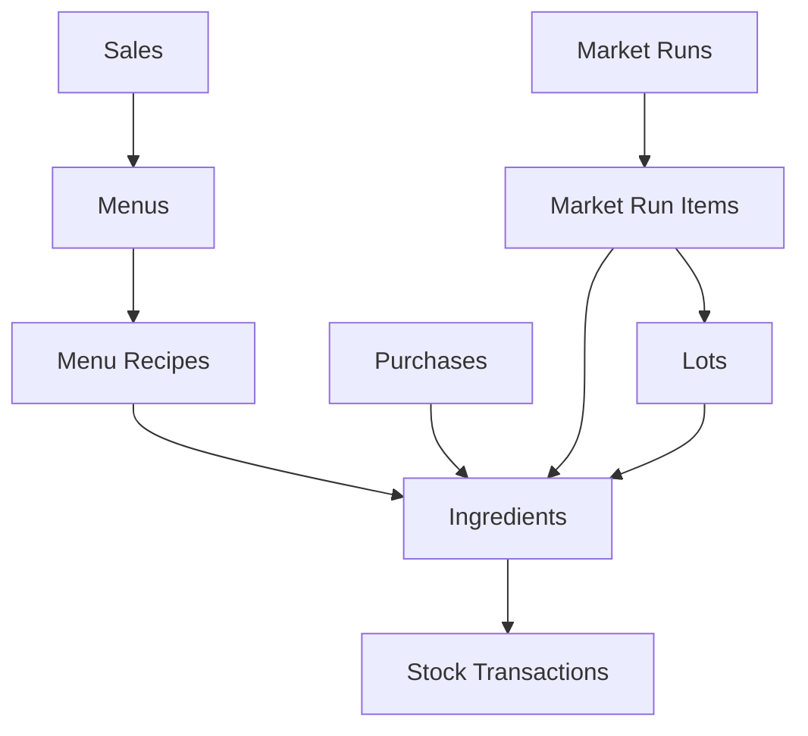

# 🍤 กุ้งแซ่บ เจ๊แพท - POS & Inventory System

## Complete Migration: Google Sheets → Supabase

[](https://supabase.com)
[](#tables)
[](#)

---

## 🚀 Quick Start

### 1. Deploy Database
```sql
-- Run in Supabase SQL Editor
database-schema-clean.sql
```

### 2. Test Everything
```bash
open test-setup.html
# Should show: 26/26 tables ✅
```

### 3. Enable Real-Time
```
Dashboard → Database → Replication
Enable: platforms, sales, ingredients, menus
```

### 4. Deploy to Mobile & Share with Team 📱
**Fastest way (5 minutes):**
- See `QUICK_DEPLOY.md` for instant deployment
- Or `DEPLOYMENT_GUIDE.md` for detailed options

**Recommended:** Deploy to [Netlify](https://netlify.com) - just drag & drop your folder!

---

## 📊 Complete Feature Set

### 26 Tables (All Your Google Sheets Tabs)

```
✅ Core Business (13)
├── users               User management
├── platforms           Delivery platforms (Grab, FoodPanda, etc)
├── categories          Product categories  
├── ingredients         Ingredient inventory
├── menus               Menu items & pricing
├── menu_recipes        Recipe ingredients
├── sales               Sales transactions
├── purchases           Ingredient purchases
├── stock_transactions  Stock audit trail
├── stock_adjustments   Manual adjustments
├── expenses            Business expenses
├── labor_logs          Employee time tracking
└── waste               Waste tracking

✅ Advanced Features (13)
├── cost_centers        Department tracking
├── packaging           Packaging materials
├── lots                Batch/lot tracking + expiry
├── market_runs         Bulk purchasing trips 🔥
├── market_run_items    Market purchase details 🔥
├── cogs                Cost of goods sold
├── stocks              Multi-location inventory
├── packing             Finished product packing
├── packing_purchases   Packaging purchases
├── overheads           Overhead allocation
├── menu_extras         Add-ons & customizations
├── batches             Production batches
└── batch_cost_lines    Batch cost breakdown
```

---

## 🔥 Auto-Magic Features

### Smart Automation
- ✅ **Auto-calculate** menu costs from ingredients
- ✅ **Auto-update** inventory on every sale
- ✅ **Auto-track** profit margins
- ✅ **Auto-sum** market run totals
- ✅ **Auto-alert** low stock & expired items
- ✅ **FIFO tracking** with lot numbers
- ✅ **Real-time sync** across all devices

### Instant Reports
- 📊 Daily sales by platform
- 📉 Low stock alerts
- 💰 COGS analysis per menu
- 📦 Expired lots tracking
- 🏪 Stock by location
- 🛒 Market run summaries
- 💵 Packaging inventory value
- 🍳 Production batch costs

---

## 📁 Project Files

| File | Purpose | Lines |
|------|---------|-------|
| **database-schema-clean.sql** | Complete database schema | 1,130+ |
| **test-setup.html** | Test all 26 tables | 750+ |
| **data-migration.js** | Migrate from Firebase | 650+ |
| **TABLES_OVERVIEW.md** | Detailed documentation | - |
| **MIGRATION_COMPLETE.md** | Migration guide | - |

---

## 🎯 Why This is Better Than Google Sheets

| Feature | Google Sheets | Supabase ✨ |
|---------|---------------|-------------|
| Speed | ⚠️ Slow with data | ⚡ Always fast |
| Users | 😢 Limited | ∞ Unlimited |
| Real-time | ❌ Manual refresh | ✅ Instant |
| Data Safety | 🤞 Accidental deletes | 🔒 Transactional |
| Mobile | 📱 Clunky | 🚀 Native support |
| API | 🤯 Complex setup | ✅ Built-in REST/GraphQL |
| Calculations | 📝 Manual formulas | 🤖 Auto-triggered |
| Audit Trail | ❌ None | ✅ Complete history |
| Backup | 💾 Manual | ☁️ Automatic |
| Security | 🔓 Basic | 🔐 Enterprise |

---

## 🏗️ Database Structure

### Core Architecture


### Example: Market Run Flow
```
1. Create Market Run (trip to market)
   ↓
2. Add Market Run Items (what you bought)
   ↓
3. Create Lots (batch with expiry date)
   ↓
4. Update Ingredient Stock (automatic!)
   ↓
5. Track in Stock Transactions (audit trail)
```

---

## 🧪 Testing

### Run All Tests
```bash
open test-setup.html
```

### Expected Results
```
✅ Connection: < 500ms
✅ Tables: 26/26 found
✅ Authentication: Ready
✅ CRUD: All operations working
✅ Real-time: Events received
```

---

## 📖 Documentation

### Quick Links
- [📊 Table Overview](TABLES_OVERVIEW.md) - All tables explained
- [🎉 Migration Guide](MIGRATION_COMPLETE.md) - Complete migration steps
- [🔧 Schema File](database-schema-clean.sql) - Full SQL with comments

### External Resources
- [Supabase Docs](https://supabase.com/docs)
- [PostgreSQL Docs](https://www.postgresql.org/docs/)

---

## 🎨 Example Queries

### Get Low Stock Items
```sql
SELECT * FROM low_stock_view;
```

### Today's Sales by Platform
```sql
SELECT * FROM daily_sales_summary 
WHERE order_date = CURRENT_DATE;
```

### Expired Lots
```sql
SELECT * FROM expired_lots_view;
```

### Market Run Summary
```sql
SELECT * FROM market_run_summary
ORDER BY run_date DESC
LIMIT 10;
```

### COGS Analysis
```sql
SELECT * FROM cogs_analysis
WHERE date >= CURRENT_DATE - INTERVAL '7 days';
```

---

## 🔐 Security

### Row Level Security (RLS)
- ✅ Users see only their own data
- ✅ Admins see everything
- ✅ Public can view menus/platforms
- ✅ All sensitive data protected

### API Keys
- 🔑 **anon key** - Public access (safe for frontend)
- 🔐 **service_role key** - Admin access (server only)

---

## 📊 Performance

### Optimizations
- ✅ **55+ indexes** for fast queries
- ✅ **Materialized views** for complex reports
- ✅ **Efficient triggers** for calculations
- ✅ **Connection pooling** for scale
- ✅ **Real-time subscriptions** optimized

---

## 🤝 Support

### Issues?
1. Check `test-setup.html` results
2. Review `MIGRATION_COMPLETE.md`
3. Read `TABLES_OVERVIEW.md`
4. Check Supabase logs

### Need Help?
- 📧 Supabase Support
- 📚 Documentation links above
- 💬 Community forums

---

## 📈 Next Steps

### Phase 1: Deploy ✅ (You are here)
- [x] Create all 26 tables
- [x] Set up functions & triggers
- [x] Configure security
- [x] Test everything

### Phase 2: Migrate Data
- [ ] Export from Google Sheets
- [ ] Run data-migration.js
- [ ] Verify data integrity
- [ ] Test reports

### Phase 3: Build Apps
- [ ] Web dashboard
- [ ] Mobile app
- [ ] Admin panel
- [ ] Reports & analytics

---

## 🎊 Credits

**Project:** กุ้งแซ่บ เจ๊แพท POS System  
**Source:** [Google Sheets](https://docs.google.com/spreadsheets/d/1qb5_R0JhLINnU7KL3q7hFpGWT0m7OCU1sBMZ8hdUs14/)  
**Database:** Supabase PostgreSQL  
**Date:** October 31, 2025  

---

**Made with ❤️ for amazing shrimp dishes! 🍤**
